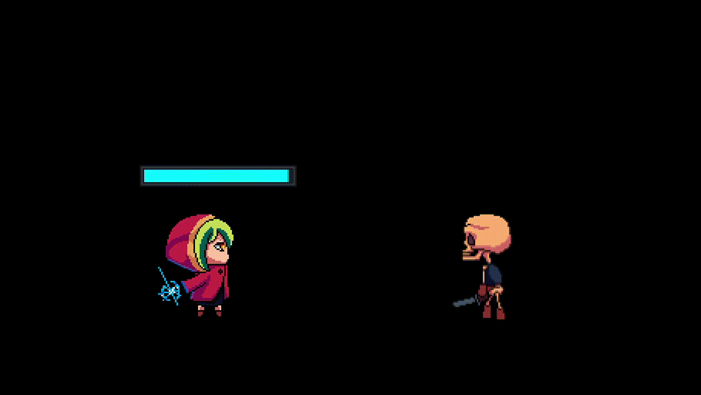

  

<h1 align="center">Hi, I'm Jhandaser</h1>
<h3 align="center">Full-Stack Developer | Student at Liceo de Cagayan University</h3>

  

- Currently developing the **Liceo Resource Hub**
- Co-founder of **CoFollow**
- Creator of **DefendYourVillage** game
- Passionate about building scalable web applications

<h3 align="left">Languages and Tools:</h3>

  
  
  
  
  
  

## Featured Projects

**DefendYourVillage** - A game project showcasing game development skills.
- [Play the game](https://defendyourvillage.netlify.app)

  

**Liceo Resource Hub** - A comprehensive resource platform for Liceo de Cagayan University.

**CoFollow** - Co-founder of a collaborative project focused on social connectivity and community engagement.
