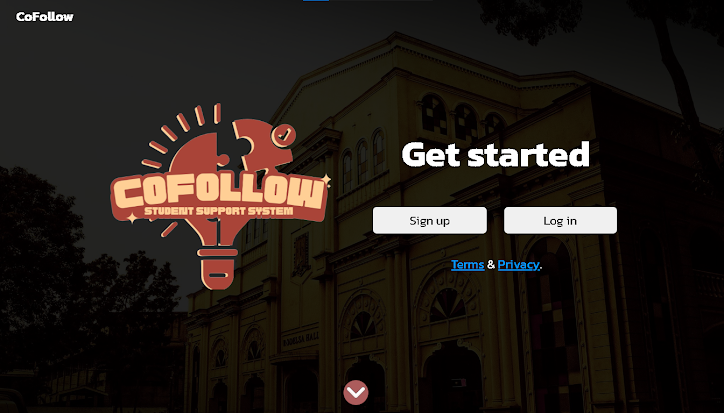

  
  
 

# 👋 Hello, Name's Boscine
### ✨ Full-Stack Developer | Innovator | Student ✨

---

### 🚀 About Me

- 🏢 Currently developing the **Liceo Resource Hub**
- 🤝 Co-founder of **CoFollow**
- 🎮 Creator of **DefendYourVillage**
- 💻 Passionate about building scalable, high-performance web applications

---

### 🛠️ Languages and Tools

   
   
  
  
  

   
   
  
   

  
   
   
  

---

  
## 🏆 `◈ FEATURED PROJECTS ◈`
  

### ⚔️ **DefendYourVillage**
> A survival game project showcasing game development and animation skills.
- 🎮 **[Launch Game](https://defendyourvillage.netlify.app)**
- 📂 **[View Gallery](https://imgur.com/a/8pbIJab)**

  

 

### 📚 **Liceo Resource Hub**
> A comprehensive resource engine for university students.
- 🔨 Status: `Active Development`
- 🎯 Goal: Streamline educational material management.

 

### 👥 **CoFollow**
> Collaborative platform focusing on community growth.
- 🤝 Role: `Co-founder` 

  

---
