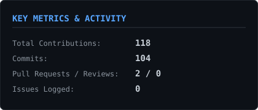
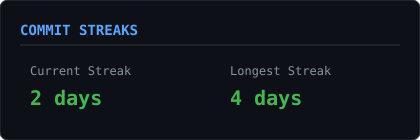
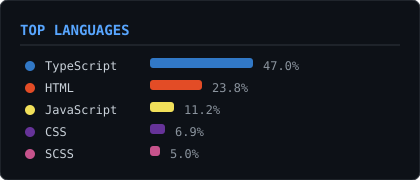
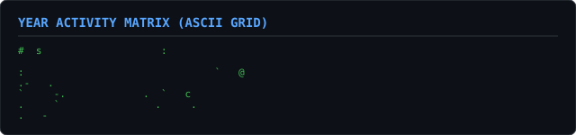

<blockquote>
<b>System Operator &amp; Software Architect</b> 
Specializing in high-performance distributed systems, self-hosted tools, 
and terminal-first software design.
</blockquote>

 

  

  

 

  

  
  &nbsp;&nbsp;
  

 

  

 

  

 

  <samp>STATUS: OPERATIONAL</samp> | <samp>LOCATION: UTC</samp> | <samp>SELF-HOSTED READOUT</samp>

